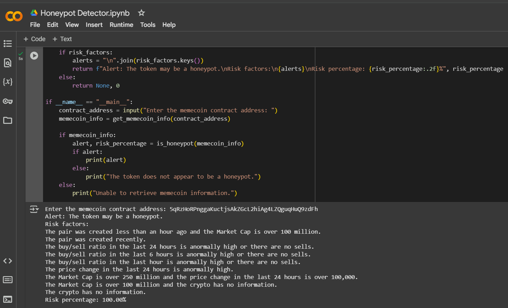
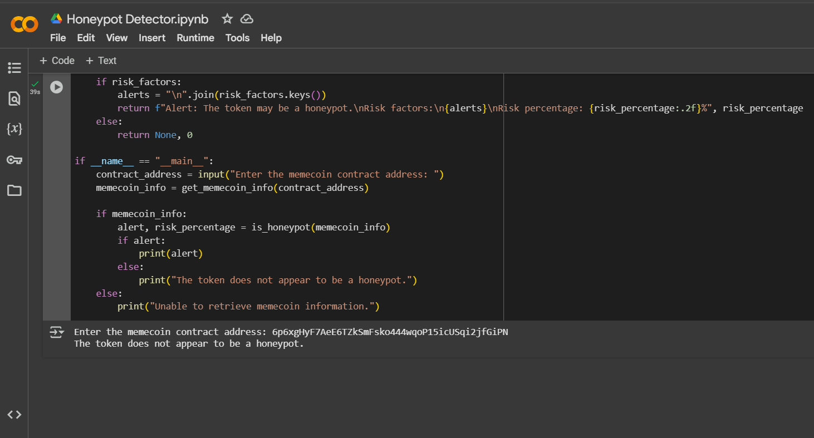

# Honeypot-Detector

This Python script is designed to analyze a cryptocurrency token (a "memecoin") and determine if it exhibits characteristics of a honeypot. 
Honeypot: A type of scam where users can buy but not sell the token. It does so by fetching data from the Dexscreener API, checking trading patterns, and applying various risk factors.




Steps involved in writing this script:

# Token Honeypot Detection Script breakdown:

## 1. Importing Dependencies
- `requests`: Used for making API calls.
- `datetime`: Used for time-based calculations.

## 2. Fetching Token Data
- **Function:** `get_memecoin_info(contract_address)`
- **Steps:**
  1. Constructs the API URL using `contract_address`.
  2. Sends a `GET` request to **Dexscreener API**.
  3. If the response is **successful** (`status_code == 200`), return JSON data.
  4. Otherwise, return `None`.

## 3. Calculating Risk Percentage
- **Function:** `calculate_risk_percentage(risk_factors)`
- **Steps:**
  1. Sum up all **risk factor weights**.
  2. Normalize risk percentage to a **maximum of 100%**.
  3. Return the calculated value.

## 4. Honeypot Detection Logic

### 4.1 Extracting Key Trading Data
- Extracts:
  - Buy/sell transactions for **24h, 6h, 1h**.
  - **Liquidity, Market Cap, Price Change**.
  - Pair creation timestamp.

### 4.2 Defining Risk Thresholds
- **Thresholds used to determine risk:**
  - **Buy/Sell Ratio:**
    - 24h: `2.2`
    - 6h: `2.3`
    - 1h: `2.5`
  - **Liquidity Thresholds:**
    - Minimum: `$10,000`
    - Very Low: `$1,000`
  - **Market Cap Conditions:**
    - High-risk if above **$250M**.
  - **Recent Pair Conditions:**
    - Created in **last 2 hours** → Higher risk.

### 4.3 Applying Risk Factors
- **Checks different risk conditions:**
  - If the **pair was created recently**, assign **30 points**.
  - If the **buy/sell ratio is abnormal**, assign **10-20 points**.
  - If **liquidity is low**, assign **5-10 points**.
  - If **market cap is high but missing information**, assign **25 points**.

### 4.4 Final Risk Calculation
- **Steps:**
  1. Call `calculate_risk_percentage(risk_factors)`.
  2. If risk percentage > **0%**, generate an **alert**.
  3. If no risk detected, mark the token as **safe**.

## 5. Running the Script
```python
if __name__ == "__main__":
    contract_address = input("Enter the memecoin contract address: ")
    memecoin_info = get_memecoin_info(contract_address)

    if memecoin_info:
        alert, risk_percentage = is_honeypot(memecoin_info)
        if alert:
            print(alert)
        else:
            print("The token does not appear to be a hon
